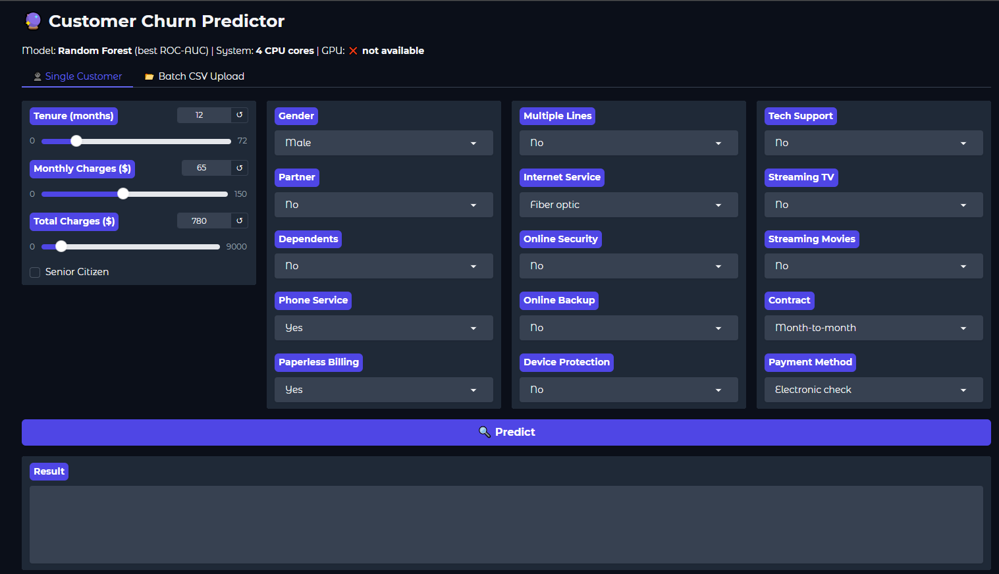
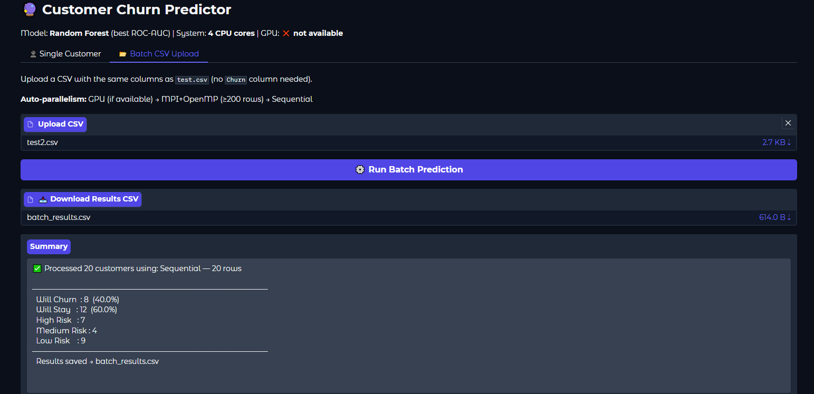

# Customer Churn Detection Model

> **Course:** Parallel and Distributed Computing (PDC) — Semester 6  
> **Topic:** Applying OpenMP, MPI, and GPU parallelism to a real-world Machine Learning pipeline

---

## What This Project Does

This project predicts whether a telecom customer will **churn (leave)** or **stay**, using a machine learning model trained on real customer data.

The main PDC contribution is demonstrating **three levels of parallelism** inside a single end-to-end ML pipeline:

| Level | Technology | Where Applied |
|---|---|---|
| Thread-level | **OpenMP** (via scikit-learn `n_jobs`) | Model training — Random Forest & Logistic Regression |
| Process-level | **MPI** (simulated via `joblib + numpy`) | Batch prediction pipeline — scatter / process / gather |
| Accelerator | **GPU** (NVIDIA cuML, optional) | Large-batch inference (auto-detected at runtime) |

---

## Project Architecture

```
raw CSV data (train.csv / test.csv)
        │
        ▼
┌─────────────────────────────┐
│  Section 1-2: Load & Clean  │
└────────────┬────────────────┘
             │
             ▼
┌─────────────────────────────┐
│  Section 3: EDA             │  (stats & correlation analysis)
└────────────┬────────────────┘
             │
             ▼
┌─────────────────────────────┐
│  Section 4-5: Preprocessing │  (encoding, train/val split)
└────────────┬────────────────┘
             │
        ┌────┴────┐
        ▼         ▼
  Sequential    OpenMP            ← Section 6 (PDC Core)
  (n_jobs=1)  (n_jobs=-1)         RF + LR, timed & compared
        │         │
        └────┬────┘
             │
             ▼
┌─────────────────────────────┐
│  Section 7: Evaluation      │  confusion matrix, ROC-AUC,
│                             │  feature importance
└────────────┬────────────────┘
             │
             ▼
┌─────────────────────────────┐
│  Section 8: Batch Pipeline  │  MPI scatter → OpenMP infer
│  (MPI + OpenMP)             │  → MPI gather → CSV report
└────────────┬────────────────┘
             │
             ▼
┌─────────────────────────────┐
│  Section 9: Comparison      │  speedup table
└────────────┬────────────────┘
             │
             ▼
┌─────────────────────────────┐
│  Section 10: Gradio UI      │  Tab 1: Single customer
│                             │  Tab 2: CSV batch upload
│                             │  (auto GPU → MPI → Sequential)
└─────────────────────────────┘
```

---

## Gradio UI — Screenshots

### Tab 1 — Single Customer Prediction
Enter one customer's details using dropdowns and sliders. Click **Predict** to get:
- Churn probability (%)
- Risk level (Low / Medium / High)
- Which parallelism was used



---

### Tab 2 — Batch CSV Upload
Upload a CSV file with multiple customers (same columns as `test.csv`, no `Churn` column needed).  
The system **automatically selects** the fastest parallelism strategy:

| Batch Size | Strategy Chosen |
|---|---|
| < 200 rows | Sequential |
| ≥ 200 rows | MPI-split + OpenMP (all CPU cores) |
| ≥ 1000 rows + GPU | NVIDIA cuML GPU inference |

Output: downloadable `batch_results.csv` with `id`, `Churn_Probability`, `Churn_Prediction`, `Risk_Level`, `Verdict`.



---

## Parallelism in Detail

### OpenMP (Thread Parallelism)
```python
# Trains 100 decision trees across ALL CPU cores simultaneously
rf_parallel = RandomForestClassifier(n_jobs=-1)   # OpenMP
rf_parallel.fit(X_train, y_train)
```
Scikit-learn internally uses OpenMP C extensions, controlled by `n_jobs=-1` which maps to all available threads.

### MPI (Distributed / Process Parallelism — Simulated)
```python
# MPI Scatter — split data into N chunks (one per core/node)
chunks = np.array_split(X_test_processed, num_nodes)

# Parallel execution — each chunk processed independently
all_probs = Parallel(n_jobs=-1)(
    delayed(predict_chunk)(chunk, model) for chunk in chunks
)

# MPI Gather — merge results back
final_probs = np.concatenate(all_probs)
```
`joblib.Parallel` simulates the MPI communication pattern (scatter → process → gather) without requiring a cluster.

### GPU (NVIDIA cuML — Optional)
```python
try:
    import cuml          # auto-detected at startup
    GPU_AVAILABLE = True
except ImportError:
    GPU_AVAILABLE = False  # graceful fallback to CPU
```
Activated automatically when batch size ≥ 1000 rows and cuML is installed.

---

## Model Performance

| Model | Strategy | ROC-AUC |
|---|---|---|
| Random Forest | Sequential (1 core) | ~0.83 |
| Random Forest | **OpenMP (all cores)** | **~0.83** |
| Logistic Regression | Sequential | ~0.80 |
| Logistic Regression | OpenMP | ~0.80 |

> Random Forest (OpenMP) is the **best model** — same accuracy as sequential but significantly faster.

---

## How to Run

### 1. Clone the repository
```bash
git clone https://github.com/Asadnaeem23/Customer-Churn-Detection-Model.git
cd Customer-Churn-Detection-Model
```

### 2. Install dependencies
```bash
pip install -r requirements.txt
```

### 3. Open the notebook
```bash
jupyter notebook churn.ipynb
```

### 4. Run all cells top-to-bottom
- Sections 1–5: Data loading, cleaning, preprocessing
- Section 6: Train sequential + OpenMP models (timings printed)
- Section 7: Model evaluation (confusion matrix, ROC-AUC)
- Section 8: MPI-style batch pipeline → saves `churn_predictions.csv`
- Section 9: Speedup comparison table
- Section 10: Launches Gradio UI at `http://127.0.0.1:7860`

### 5. (Optional) Enable GPU
```bash
pip install cuml-cu11   # NVIDIA GPU + CUDA 11 required
```

---

## File Structure

```
Customer-Churn-Detection-Model/
├── churn.ipynb            ← Main notebook (all 10 sections)
├── train.csv              ← Training data
├── test.csv               ← Test data (for batch prediction)
├── requirements.txt       ← Python dependencies
├── PARALLELISM_GUIDE.md   ← Detailed explanation of all parallelism usage
├── screenshots/           ← UI screenshots
│   ├── ui_single_customer.png
│   └── ui_batch_csv.png
└── README.md              ← This file
```

---

## Tech Stack

| Category | Library / Tool |
|---|---|
| Language | Python 3.x |
| ML Models | scikit-learn, XGBoost, LightGBM, CatBoost |
| Parallelism | joblib, multiprocessing, scikit-learn `n_jobs` |
| GPU (optional) | NVIDIA cuML (RAPIDS) |
| UI | Gradio |
| Notebook | Jupyter |
| Data | pandas, numpy, scipy |
| Hyperparameter tuning | Optuna |

---

## See Also

- [PARALLELISM_GUIDE.md](PARALLELISM_GUIDE.md) — full breakdown of every parallelism usage with code snippets, data-flow diagrams, and decision logic
